# Starbucks_Capstone_Project报告

## 项目定义

1. 项目背景
本数据集是基于星巴克真实数据集，模拟 Starbucks rewards 移动 app 上用户行为的数据。每隔几天，星巴克会向 app 的用户发送一些推送。这个推送可能仅仅是一条饮品的广告或者是折扣券或 BOGO（买一送一）。不同顾客收到的推送可能是不同的，种类可能不同，数量可能不同，甚至存在没有收到推送的顾客。

2. 定义问题，明确目标
一家优秀的企业一定是在可以为顾客提供优质服务或产品后，得到稳定盈利的，这需要了解顾客，了解市场环境。如何客观了解这些信息，数据可以给出答案。本项目数据集就是包含了顾客、app推送和交易数据，利用这些信息，我们就可以将这三类数据结合起来，给出每一次交易是否达成的判断指标，这样不同人群面对推送会做出怎样的反应，不同的推送对购买行为有怎样的影响，就可以建立一个模型来评价了。

可以选用机器学习模型来做预测，模型预测是否达成购买行为的准确性（Accuracy）和二元分类评价指标F1-score越高，说明模型越优。

## 数据探索

### 数据概览
先来看看有哪些数据，这些数据是不是clean，是否需要补充、删减、组合，甚至是否需要修改（当然修改数据是非常谨慎的，这次项目没有去修改数据 :）
数据集一共包括三个dataframe文件：

1. portfolio.json，10 个推送 x 6 个字段，30 天试验期间的推送，包含推送ID和有关每个推送（持续时间，类型等）的元数据
    - reward：数值变量，满足推送的要求后给与的优惠
    - channels：字符串列表 - 网站 web；邮件 email；短信 mobile；社交平台 social
    - difficulty：数值变量，满足推送的要求所需的最少花费，即最低消费额度
    - duration：数值变量，推送持续的时间，单位是天
    - offer_type：推送的种类，例如 BOGO、打折（discount）、信息（informational）
    - id：string/hash，推送 id

2. profile.json，17000 个用户 x 5 个字段，得到奖励的顾客个人基本信息
    - gender：性别，分类变量，M, F, O, 或者 null
    - age：年龄，数值变量，缺失值编码为118
    - id：string/hash，顾客 ID
    - became_member_on：第一次注册时间，日期格式 - YYYYMMDD
    - income：收入，数值变量

3. transcript.json ，306648 个事件 x 4 个字段，交易记录transaction，已收到offer，已查看offer和已完成offer的记录
    - person：string/hash，顾客id
    - event：string，收到的推送 offer received；推送已阅offer viewed；交易记录 transaction；完成的推送交易 offer completed
    - value：字典，类型根据事件的类型而变
    - offer id：(string/hash) 推送 id
    - amount：(数值变量) 交易额
    - reward：(数值变量) 满足推送的要求后得到的优惠
    - time：数值变量，开始实验后第几个小时

### 预处理

1. 探索和清洗Portfolio
对于推送数据集（portfolio），展示了有哪些推送类型，用什么推送方式，推送持续了多久，优惠力度，都会影响购买。
使用scikit-learn MultiLabelBinarizer 拆分了Channels列，实现了one-hot encoded，还需要将id变量重命名为offer_id，以将其与客户ID区分开，并删除不需要的列后如下，

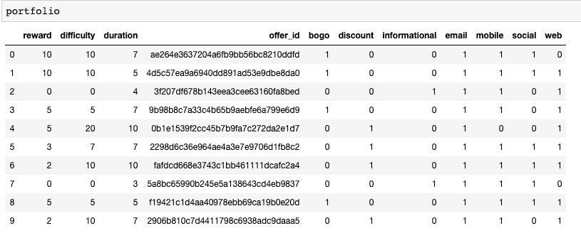

核查空值情况，

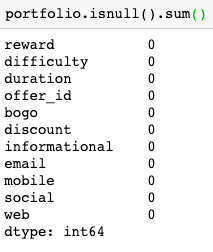

Portfolio中并不存在空值。

2. 探索和清洗Profile

对于顾客数据集（profile），某些字段是存在空值的，对于空值的处理，是需要一定判断的，看看数据分布，如果空值不多，而且影响了分布，那就可以删除这些空值存在的行。顾客数据集中有年龄、性别、收入和入会时间，这些信息很有价值，可能是影响购买的重要feature。
我们可以发现年龄分布如下

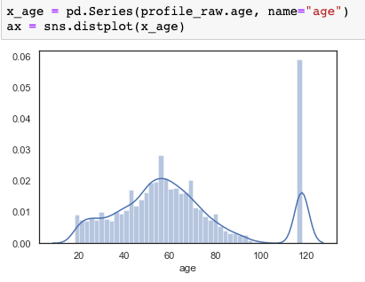

如下处理后可发现性别和收入大约有12％的缺失数据。

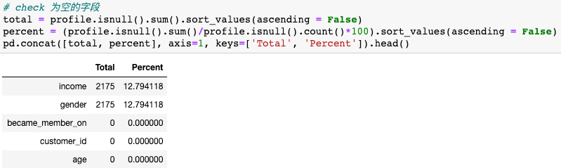

我们去查看那些年龄为118的顾客，发现他们确实缺少收入和性别信息，在结合查看箱型图，可对这些离群值做删除处理。


“became_member_on”必须转换为日期格式。

下图是客户收入的分布。

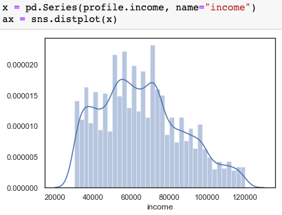

通过从性别角度进一步观察用户分布，与女性客户收入相比，男性客户收入分布略左偏，即偏向于较低收入区间。

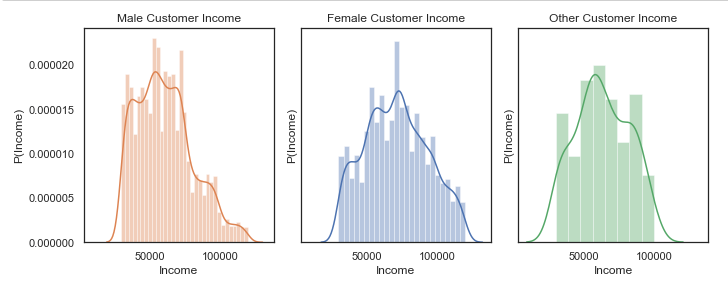

3. 探索和清洗transcript

交易数据给出了四种event类型数据，收到的推送 offer received；推送已阅offer viewed；交易记录 transaction；完成的推送交易 offer completed，三种是和offer相关，一种是交易记录。所以需要拆分出客户报价和购买数据。这主要是对value列进行处理。

```
transcript = pd.concat([transcript, transcript['value'].apply(pd.Series)], axis = 1)
# 将 offer id 和 offer_id 合并
transcript['offer_id_combine'] = np.where(transcript['offer id'].isnull() & transcript['offer_id'].notnull(), transcript['offer_id'], transcript['offer id'])
transcript.drop(columns = ['offer id','offer_id'], inplace = True)
transcript.rename(columns = {'offer_id_combine':'offer_id'}, inplace = True)
transcript.head()
```

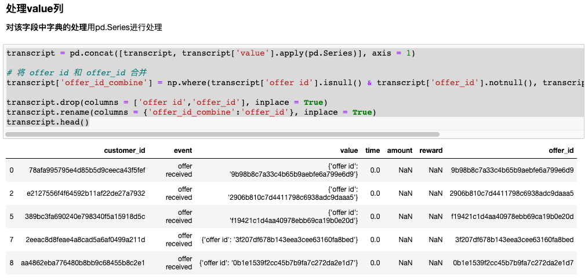

之后将offer类数据和交易类数据分离开，处理如下
**offer_data 数据集**
   
```
event_df = pd.get_dummies(transcript['event'])
# Create a DataFrame that describes customer offer events
transcript = pd.concat([transcript, event_df], axis=1)
transcript.rename(columns={'offer completed':'completed','offer received':'received','offer viewed':'viewed'},inplace=True)
transcript.drop(columns=['event','value'],inplace=True)
# offer_data 是 交易数据
offer_data = transcript.drop(columns=['amount','reward','transaction'])
offer_data.head()
```

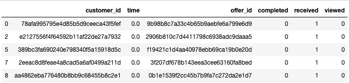

**transaction_data 数据集**
```

# transaction_data 是 event 为 transaction的数据集
transaction_data = transcript.drop(columns=['reward','offer_id','completed','received','viewed'])
transaction_data = transaction_data[transaction_data['transaction']==1]
transaction_data.head()
```

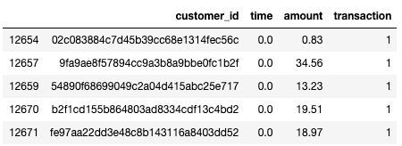

## 结合各数据集，建立交易成功指标

基于交易漏斗思维，每一次交易最终会实现转换，是否会成功，所以我对每一次交易也添加了是否成功的标签，这个标签就是每一次交易的target。
对于每一个客户的一次成功的交易，在offer_data和transaction_data数据中都可以找到相应信息，我们先确定一个有效offer都开始时间和结束时间，开始时间就是推送的触发时间，结束时间点就是开始点加上持续时间，**如果一次交易发生时间点介于推送开始和结束之间，同时其查看该推送时间也是在该推送的开始和结束之间的话，这就是一次成功的购买行为。** 之后这行transaction_data可以结合顾客profile信息和关于推送的portfilo信息。

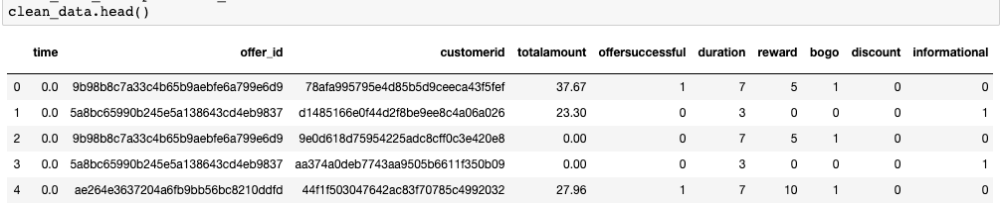

## 分析成果

将不同offerid 做groupby，并按照成功占比进行倒序排列，即后可得到如下数据集，

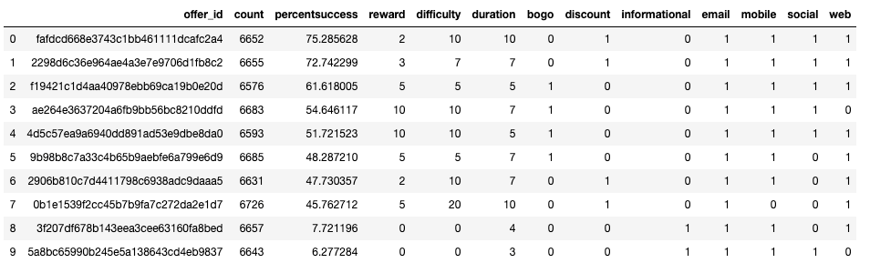

从中看出高质量推送具有的特征是，

- 需要有discount的推送
- 需要持续一次时间的
- reward并不需要很高，这点讨巧。
- 在成功购买的offer中，男性和女性的totalamount分布形状基本相同，男性在amount为20附近略微集中一些。

## 基于机器学习模型的预测

当我拥有了feature和target，很自然就可以建立一个机器学习模型，根据大量数据去做评估和预测。机器学习模型有很多种，我选取了sklearn中的常用模型：logistic regression, random forest, and gradient boosting models。利用各模型的`accuracy, f1_score`两个指标去比较模型，其中，**random forest是训练数据集中的相对较好模型**，其准确性为0.72，f1_score为0.72，AUC为0.78。当我们使用测试数据进行分析时，准确性达到0.71，f1_score达到0.71。该模型没有出现预测的过拟合。

#### 指标对比

- 针对二元分类器，准确率是最常见的评价指标，就是被分对的样本数除以所有的样本数，通常来说，正确率越高，分类器越好，但是有时候准确率高并不能代表一个算法就好。
- 精确率表示被分为正例的示例中实际为正例的比例，召回率是覆盖面的度量，表示有多个正例被分为正例，recall=TP/(TP+FN)=TP/P=sensitive，可以看到召回率与灵敏度是一样的。
- 精确率和召回率有时候会出现的矛盾的情况，这样就需要综合考虑他们，最常见的方法就是F-Measure（又称为F-Score）。F-Measure是Precision和Recall加权调和平均。当参数α=1时，就是最常见的F1，也即当F1较高时则能说明试验方法比较有效。

本项目运行结果是random forest, and gradient boosting models 准确值较为接近，random forest的F1-score略高。

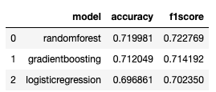

曲线与FP_rate轴围成的面积（记作AUC）越大，说明性能越好，本项目中random forest, 和 gradient boosting models AUC值基本一致。

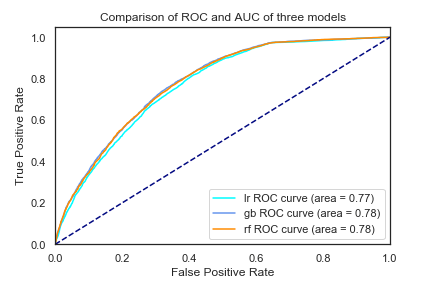

#### 调参
本项目采用 RandomizedSearchCV 进行调参。GridSearchCV可以保证在指定的参数范围内找到精度最高的参数，但是这也是网格搜索的缺陷所在，它要求遍历所有可能参数的组合，在面对大数据集和多参数的情况下，相对耗时。本文会采用后一种RandomizedSearchCV随机参数搜索的方法。尝试优化的超参数及其尝试优化的多个值如下，

```
# Number of trees in random forest
n_estimators = [10, 20, 50, 100]

# Number of features to consider at every split
max_features = ['log2', 'sqrt', 10]

# Minimum number of samples required to split a node
min_samples_split = [2, 4, 10]

# Minimum number of samples required at each leaf node
min_samples_leaf = [2, 4]

# 最大深度
max_depth = [2,4,10]

# 学习率
learning_rate = [0.1, 0.05, 0.001]
```

运行结果如下

```
RandomForestClassifier(bootstrap=True, class_weight=None, criterion='gini',
                       max_depth=10, max_features=10, max_leaf_nodes=None,
                       min_impurity_decrease=0.0, min_impurity_split=None,
                       min_samples_leaf=2, min_samples_split=4,
                       min_weight_fraction_leaf=0.0, n_estimators=20,
                       n_jobs=None, oob_score=False, random_state=0, verbose=0,
                       warm_start=False)
```

#### random forest模型并没有存在过拟合

进行调参的参数是train_size，我train_size设置了6个数（0.1，0.2，0.4，…），所以train_size为0.2即可。

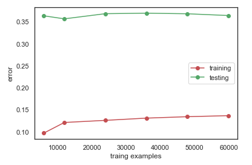

#### random forest模型在不同n_estimators取值情况下的准确性

可以看到当n_estimators取值大于20以后，性能增长不多

```
train_score = array([0.86345735, 0.87089751, 0.87392336, 0.87480054, 0.87483563, 0.87483897, 0.87483897])
```

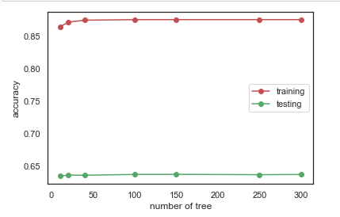

#### 模型结论

GradientBoosting和Random Forest两种模型效果很接近，而Random Forest的准确性略高一些。根据各个指标对于交易是否成功影响的重要性可以发现

- 顾客个人信息中，收入高低是决定购买的重要因素
- 顾客对bogo的反应要比discount的要好。
- 男性比女性更有可能购买。
- 年龄段20-30顾客更容易消费。
- 通过社交平台进行推广，效果更好。

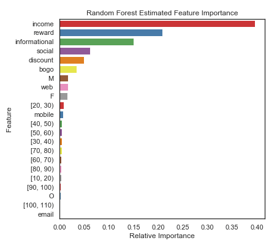

## 挑战、可能的改进点和一些思考

#### 项目挑战

这个项目的数据量不少，但是如何抽象出确定由于推送影响成功购买的交易，是本项目目标中的挑战之处。

#### 改进点
这些分析过程和成果在jupyter notebook中都有展示，选用python，使用的环境是常见库，当然整个项目最关键的地方就是如何实现交易转换漏斗，如何用机器学习模型去解释和预测现实中的购买行为。进一步改善模型目前有两个思路：

- 由于客户收入、报价持续时间、报价奖励这些数字特征对于模型影响较大：可以创建一个融合以上特征的全新多项式指标来改善机器学习模型。如new_feature特征，`new_feature = duration*reward/income`，之后将该特征也做归一化处理，进行模型训练。
- 是不是可以尝试用主成分分析，去减少数据集的feature维度。
- 可以借助这篇论文提到的欧几里得空间的函数逼近来实现映射分类变量。This is [the paper link](https://arxiv.org/abs/1604.06737). 

#### 跳脱项目外的一些思考

Udacity提供的数据集是非常棒的，已经有了很多维度，但是生活经验告诉我们，影响销量的已经不仅仅是这款产品自身做的好不好，而是要放眼其相应行业，甚至相关行业。国人不仅仅由于推送的变化去改变自己喝咖啡的次数，他可能为了和朋友逛街而使用了喜茶推送，他可能由于工作太忙而选择了瑞幸的配送，他可能由于当前的新冠肺炎疫情（2020年2月，中国加油）宅在家而选择了已经囤的其他饮料。
**所以要跳脱数据，看看更精彩的大环境。**

## 参考文献

1. [Investigating Starbucks Customers Segmentation using Unsupervised Machine Learning](https://medium.com/@jeffrisandy/investigating-starbucks-customers-segmentation-using-unsupervised-machine-learning-10b2ac0cfd3b)

2. [Sparkify Project Report](https://github.com/TrW236/DataScientistND/blob/master/CP_Sparkify/report.md)

3. [GridSearchCV 与 RandomizedSearchCV 调参](https://blog.csdn.net/juezhanangle/article/details/80051256)

4. [sklearn模型调优（判断是否过过拟合及选择参数）](https://blog.csdn.net/u012328159/article/details/79255433)

5. [机器学习：准确率(Precision)、召回率(Recall)、F值(F-Measure)、ROC曲线、PR曲线](https://blog.csdn.net/quiet_girl/article/details/70830796#_jmp0_)