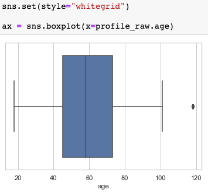
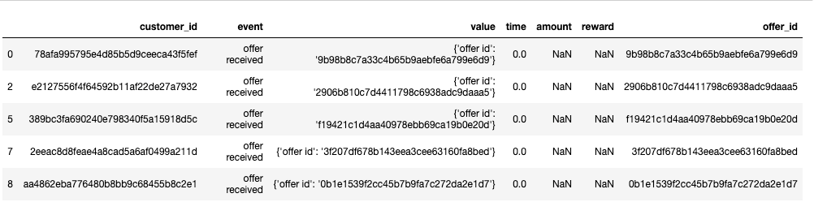
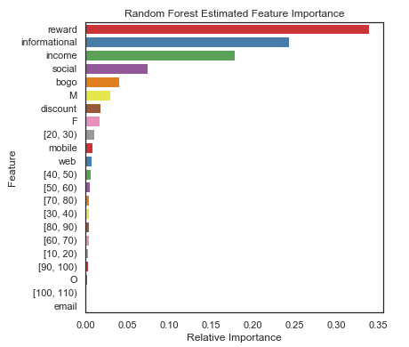

# Starbucks_Capstone_Project报告

## 项目定义

1. 项目背景
本数据集是基于星巴克真实数据集，模拟 Starbucks rewards 移动 app 上用户行为的数据。每隔几天，星巴克会向 app 的用户发送一些推送。这个推送可能仅仅是一条饮品的广告或者是折扣券或 BOGO（买一送一）。不同顾客收到的推送可能是不同的，种类可能不同，数量可能不同，甚至存在没有收到推送的顾客。
2. 问题的定义与解决思路
一家优秀的企业一定是在可以为顾客提供优质服务或产品后，得到稳定盈利的，这需要了解顾客，了解市场环境。如何客观了解这些信息，数据可以给出答案。本项目数据集就是包含了顾客、app推送和交易数据，利用这些信息，我们就可以将这三类数据结合起来，给出每一次交易是否达成的判断指标，这样不同人群面对推送会做出怎样的反应，不同的推送对购买行为有怎样的影响，就可以建立一个模型来评价了。

## 数据探索

### 数据概览
先来看看有哪些数据，这些数据是不是clean，是否需要补充、删减、组合，甚至是否需要修改（当然修改数据是非常谨慎的，这次项目没有去修改数据 :）
数据集一共包括三个dataframe文件：

1. portfolio.json，10 个推送 x 6 个字段，30 天试验期间的推送，包含推送ID和有关每个推送（持续时间，类型等）的元数据
    - reward：数值变量，满足推送的要求后给与的优惠
    - channels：字符串列表 - 网站 web；邮件 email；短信 mobile；社交平台 social
    - difficulty：数值变量，满足推送的要求所需的最少花费，即最低消费额度
    - duration：数值变量，推送持续的时间，单位是天
    - offer_type：推送的种类，例如 BOGO、打折（discount）、信息（informational）
    - id：string/hash，推送 id

2. profile.json，17000 个用户 x 5 个字段，得到奖励的顾客个人基本信息
    - gender：性别，分类变量，M, F, O, 或者 null
    - age：年龄，数值变量，缺失值编码为118
    - id：string/hash，顾客 ID
    - became_member_on：第一次注册时间，日期格式 - YYYYMMDD
    - income：收入，数值变量

3. transcript.json ，306648 个事件 x 4 个字段，交易记录transaction，已收到offer，已查看offer和已完成offer的记录
    - person：string/hash，顾客id
    - event：string，收到的推送 offer received；推送已阅offer viewed；交易记录 transaction；完成的推送交易 offer completed
    - value：字典，类型根据事件的类型而变
    - offer id：(string/hash) 推送 id
    - amount：(数值变量) 交易额
    - reward：(数值变量) 满足推送的要求后得到的优惠
    - time：数值变量，开始实验后第几个小时

### 预处理

1. 探索和清洗Portfolio
对于推送数据集（portfolio），展示了有哪些推送类型，用什么推送方式，推送持续了多久，优惠力度，都会影响购买。
使用scikit-learn MultiLabelBinarizer 拆分了Channels列，实现了one-hot encoded，还需要将id变量重命名为offer_id，以将其与客户ID区分开，并删除不需要的列后如下，


核查空值情况，

Portfolio中并不存在空值。

2. 探索和清洗Profile

对于顾客数据集（profile），某些字段是存在空值的，对于空值的处理，是需要一定判断的，看看数据分布，如果空值不多，而且影响了分布，那就可以删除这些空值存在的行。顾客数据集中有年龄、性别、收入和入会时间，这些信息很有价值，可能是影响购买的重要feature。
我们可以发现年龄分布如下


如下处理后可发现性别和收入大约有12％的缺失数据。


我们去查看那些年龄为118的顾客，发现他们确实缺少收入和性别信息，在结合查看箱型图，可对这些离群值做删除处理。



“became_member_on”必须转换为日期格式。

下图是客户收入的分布。


通过从性别角度进一步观察用户分布，与女性客户收入相比，男性客户收入分布略左偏，即偏向于较低收入区间。


3. 探索和清洗transcript

交易数据给出了四种event类型数据，收到的推送 offer received；推送已阅offer viewed；交易记录 transaction；完成的推送交易 offer completed，三种是和offer相关，一种是交易记录。所以需要拆分出客户报价和购买数据。这主要是对value列进行处理。

```
transcript = pd.concat([transcript, transcript['value'].apply(pd.Series)], axis = 1)
# 将 offer id 和 offer_id 合并
transcript['offer_id_combine'] = np.where(transcript['offer id'].isnull() & transcript['offer_id'].notnull(), transcript['offer_id'], transcript['offer id'])
transcript.drop(columns = ['offer id','offer_id'], inplace = True)
transcript.rename(columns = {'offer_id_combine':'offer_id'}, inplace = True)
transcript.head()
```



之后将offer类数据和交易类数据分离开，处理如下

   
```
event_df = pd.get_dummies(transcript['event'])
# Create a DataFrame that describes customer offer events
transcript = pd.concat([transcript, event_df], axis=1)
transcript.rename(columns={'offer completed':'completed','offer received':'received','offer viewed':'viewed'},inplace=True)
transcript.drop(columns=['event','value'],inplace=True)
# offer_data 是 交易数据
offer_data = transcript.drop(columns=['amount','reward','transaction'])
offer_data.head()
```


```
# transaction_data 是 event 为 transaction的数据集
transaction_data = transcript.drop(columns=['reward','offer_id','completed','received','viewed'])
transaction_data = transaction_data[transaction_data['transaction']==1]
transaction_data.head()
```


## 结合各数据集，建立交易成功指标

基于交易漏斗思维，每一次交易最终会实现转换，是否会成功，所以我对每一次交易也添加了是否成功的标签，这个标签就是每一次交易的target。
对于每一个客户的一次成功的交易，在offer_data和transaction_data数据中都可以找到相应信息，我们先确定一个有效offer都开始时间和结束时间，开始时间就是推送的触发时间，结束时间点就是开始点加上持续时间，**如果一次交易发生时间点介于推送开始和结束之间，同时其查看该推送时间也是在该推送的开始和结束之间的话，这就是一次成功的购买行为。** 之后这行transaction_data可以结合顾客profile信息和关于推送的portfilo信息。


## 分析成果

将不同offerid 做groupby，并按照成功占比进行倒序排列，即后可得到如下数据集，


从中看出高质量推送具有的特征是，

- 需要有discount的推送
- 需要持续一次时间的
- reward并不需要很高，这点讨巧。
- 在成功购买的offer中，男性和女性的totalamount分布形状基本相同，男性在amount为20附近略微集中一些。

## 基于机器学习模型的预测

当我拥有了feature和target，很自然就可以建立一个机器学习模型，根据大量数据去做评估和预测。机器学习模型有很多种，我选取了sklearn中的常用模型：logistic regression, random forest, and gradient boosting models。利用各模型的`accuracy, f1_score, Precision, Recall`四个指标去比较模型，其中，**random forest是训练数据集中的最佳模型**，其准确性为0.75，f1_score为0.75，Precision为0.722，Recall为0.775。当我们使用测试数据进行分析时，准确性达到0.69，f1_score达到0.69，可以说该模型没有出现预测的过拟合。


通过random forest的运行结果，可以发现众多feature中影响购买行为的程度也各不相同，从测试数据集可以发现，

- 收入是重要因素
- 顾客对discount的反应要比bogo的要好。
- 男性比女性更有可能购买。
- 年龄段20-30顾客更容易消费。
- 通过社交平台进行推广，效果更好。


## 可能的改进点和一些思考

这些分析过程和成果在jupyter notebook中都有展示，选用python，使用的环境是常见库，当然整个项目最关键的地方就是如何实现交易转换漏斗，如何用机器学习模型去解释和预测现实中的购买行为。进一步改善模型目前有两个思路：

- 由于客户收入、报价持续时间、报价奖励这些数字特征对于模型影响较大：可以创建一个融合以上特征的全新多项式指标来改善机器学习模型。如new_feature特征，`new_feature = duration*reward/income`，之后将该特征也做归一化处理，进行模型训练。
- 是不是可以尝试用主成分分析，去减少数据集的feature维度。

#### 跳脱项目外的一些思考

Udacity提供的数据集是非常棒的，已经有了很多维度，但是生活经验告诉我们，影响销量的已经不仅仅是这款产品自身做的好不好，而是要放眼其相应行业，甚至相关行业。国人不仅仅由于推送的变化去改变自己喝咖啡的次数，他可能为了和朋友逛街而使用了喜茶推送，他可能由于工作太忙而选择了瑞幸的配送，他可能由于当前的新冠肺炎疫情（2020年2月，中国加油）宅在家而选择了已经囤的其他饮料。
**所以要跳脱数据，看看更精彩的大环境。**
